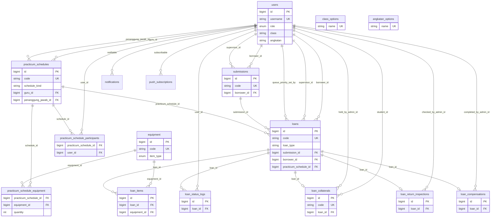

# Struktur Database — Manajemen Alat Lab TAV

Ringkasan skema setelah seluruh migrasi di `database/migrations` dijalankan. Sumber: migrasi + model Eloquent.

Alat dan bahan memakai **satu tabel** `equipment`, dibedakan `item_type`. Model `Supply` adalah alias Eloquent untuk baris `item_type = bahan`.

---

## Ringkasan tabel

| Grup | Tabel | Fungsi |
| --- | --- | --- |
| Auth & master | `users` | Admin, guru, siswa |
| Master opsi | `class_options`, `angkatan_options` | Daftar kelas & angkatan (tanpa FK) |
| Inventaris | `equipment` | Alat + bahan |
| Jadwal | `practicum_schedules` | Jadwal praktikum / Event Lomba |
| Pengajuan | `submissions` | Satu pengajuan (bisa berisi pinjaman alat + bahan) |
| Peminjaman | `loans`, `loan_items`, `loan_status_logs` | Transaksi pinjam + item + riwayat status |
| Pivot lomba | `practicum_schedule_equipment`, `practicum_schedule_participants` | Daftar alat & peserta Event Lomba |
| Pengembalian | `loan_collaterals`, `loan_return_inspections`, `loan_compensations` | Jaminan, inspeksi, kompensasi |
| Notifikasi | `notifications`, `push_subscriptions` | In-app + Web Push |
| Laravel | `sessions`, `password_reset_tokens`, `cache`, `cache_locks`, `jobs`, `job_batches`, `failed_jobs` | Infrastruktur |

Tabel pivot (Event Lomba): `practicum_schedule_equipment`, `practicum_schedule_participants`.

Tabel yang **sudah di-drop** historis: pivot alat di jadwal sempat dihapus lalu **di-restore** untuk Event Lomba.

---

## Diagram relasi



`class_options.name` dipakai sebagai nilai `users.class` dan `practicum_schedules.kelas`. `angkatan_options.name` dipakai sebagai nilai `users.angkatan`. Keduanya **lookup string**, bukan foreign key.

---

## 1. `users`

Akun aplikasi. Login memakai `username` (bukan email).

| Kolom | Tipe | Keterangan |
| --- | --- | --- |
| `id` | bigint PK | |
| `name` | string | Nama tampilan |
| `username` | string unique | Login |
| `email` | string unique | |
| `email_verified_at` | timestamp nullable | |
| `password` | string | hashed |
| `role` | enum | `admin`, `guru`, `siswa` (default `siswa`) |
| `status` | enum | `active`, `inactive` (default `active`) |
| `phone` | string(20) nullable | |
| `nisn` | string(20) nullable unique | Identitas siswa |
| `nip` | string(30) nullable | Identitas guru/admin |
| `class` | string(50) nullable | Kelas siswa, nilai dari `class_options.name` |
| `angkatan` | string(9) nullable | Format tahun ajaran, mis. `2025/2026` |
| `remember_token` | string nullable | |
| `created_at`, `updated_at` | timestamp | |

**Catatan**

- Identitas tampilan: siswa → `nisn`, guru/admin → `nip`.
- Kode prefix tidak ada; username digenerate dari email jika kosong.

---

## 2. `class_options`

Master opsi kelas. Dikelola admin.

| Kolom | Tipe | Keterangan |
| --- | --- | --- |
| `id` | bigint PK | |
| `name` | string(50) unique | Contoh `XI TAV 1` |
| `sort_order` | unsigned smallint | Default `0` |
| `created_at`, `updated_at` | timestamp | |

Dipakai jika ada user dengan `users.class = name` atau jadwal dengan `practicum_schedules.kelas = name`.

---

## 3. `angkatan_options`

Master opsi angkatan.

| Kolom | Tipe | Keterangan |
| --- | --- | --- |
| `id` | bigint PK | |
| `name` | string(9) unique | Contoh `2025/2026` |
| `sort_order` | unsigned smallint | Biasanya tahun awal, mis. `2025` |
| `created_at`, `updated_at` | timestamp | |

---

## 4. `equipment`

Inventaris alat **dan** bahan. Model: `Equipment`. Bahan juga diakses lewat `Supply` (`item_type` selalu `bahan`).

| Kolom | Tipe | Keterangan |
| --- | --- | --- |
| `id` | bigint PK | |
| `code` | string unique | `ALAT-0001` / `BAHAN-0001` |
| `name` | string | |
| `category` | string | Kategori TAV (lihat `config/lab.php`) |
| `item_type` | enum | `alat`, `bahan` (default `alat`) |
| `stock` | unsigned int | Stok total (default `1`) |
| `available` | unsigned int | Stok tersedia / belum dipinjam (default `1`) |
| `qty_baik` | unsigned int | Jumlah kondisi baik |
| `qty_rusak_ringan` | unsigned int | |
| `qty_rusak_berat` | unsigned int | |
| `location` | string nullable | Lokasi fisik |
| `description` | text nullable | |
| `image_path` | string nullable | Path di disk `public` |
| `status` | string(20) | `tersedia`, `tidak_tersedia` (default `tersedia`) |
| `unit` | string nullable | Satuan bahan, mis. `pcs` |
| `min_stock` | unsigned int nullable | Ambang stok menipis (bahan) |
| `created_at`, `updated_at` | timestamp | |

**Aturan**

- Untuk **bahan**, `qty_baik` diset sama dengan `stock`; `qty_rusak_*` = 0. `status` mengikuti stok (`stock > 0` → `tersedia`).
- Untuk **alat**, `available` dibanding `qty_baik` menentukan label: `tersedia` / `dipinjam` / `habis` / `rusak`.
- Relasi: `hasMany` `loan_items`.

Kategori alat (config): Alat ukur & uji elektronika, Peralatan kerja bangku dan perakitan, Peralatan perangkat pengolah suara, Peralatan sistem video dan dokumentasi.

Kategori bahan: Komponen elektronika pasif/aktif, Pembuatan jalur rangkaian (PCB), Penyambung dan perekat, Kabel dan konektor AV, Modul sistem AV.

---

## 5. `practicum_schedules`

Jadwal praktik lab atau Event Lomba. Kode: `JADWAL-0001`.

| Kolom | Tipe | Keterangan |
| --- | --- | --- |
| `id` | bigint PK | |
| `code` | string unique | |
| `schedule_kind` | string | `praktikum` (default) \| `lomba` |
| `title` | string | |
| `mata_kuliah` | string | Mapel TAV |
| `jurusan` | string | Default `Audio Video` |
| `kelas` | string | Nilai dari `class_options.name` |
| `tanggal` | date nullable | Wajib untuk tipe `khusus`; null untuk `mingguan` |
| `jam_mulai` | time | |
| `jam_selesai` | time | |
| `ruangan` | string nullable | |
| `guru_id` | FK → `users.id` | Guru / guru pendamping; `cascadeOnDelete` |
| `penanggung_jawab_id` | FK → `users.id` nullable | PJ siswa (wajib jika `schedule_kind=lomba`); `nullOnDelete` |
| `priority` | enum | `normal`, `tinggi`, `lomba` (default `normal`) |
| `type` | enum | `mingguan`, `khusus` (default `mingguan`) |
| `hari` | enum nullable | `senin` … `minggu`; dipakai tipe `mingguan` |
| `notes` | text nullable | |
| `created_at`, `updated_at` | timestamp | |

**Aturan**

- `mingguan`: pakai `hari`, `tanggal` null (`schedule_kind=praktikum`).
- `khusus`: pakai `tanggal`, `hari` null.
- Event Lomba: `schedule_kind=lomba`, `type=khusus`, `tanggal` wajib, PJ + peserta + alat (pivot).
- Relasi: `belongsTo` guru & penanggung jawab, `belongsToMany` equipment & participants, `hasMany` `loans`.

### Pivot `practicum_schedule_equipment`

Daftar alat Event Lomba (quantity per alat).

### Pivot `practicum_schedule_participants`

Multi siswa peserta Event Lomba (**info saja**, bukan borrower). Borrower = `penanggung_jawab_id`.

---

## 6. `submissions`

Satu pengajuan siswa. Bisa berisi 1 loan alat dan/atau 1 loan bahan. Kode: `SUB-0001`. Route key: `code`.

| Kolom | Tipe | Keterangan |
| --- | --- | --- |
| `id` | bigint PK | |
| `code` | string unique | |
| `borrower_id` | FK → `users.id` | `cascadeOnDelete` |
| `borrower_class` | string(50) nullable | Snapshot kelas saat mengajukan |
| `supervisor_id` | FK → `users.id` nullable | Guru; `nullOnDelete` |
| `purpose` | string | Tujuan pengajuan |
| `notes` | text nullable | |
| `request_date` | date | Tanggal pemakaian / booking |
| `created_at`, `updated_at` | timestamp | |

**Status agregat** (bukan kolom; dihitung dari loan anak): `diminta`, `antrian`, `diproses`, `selesai`, `dibatalkan`.

Relasi: `belongsTo` borrower & supervisor, `hasMany` `loans`.

---

## 7. `loans`

Satu transaksi pinjam untuk satu `item_type` (`alat` **atau** `bahan`). Kode: `PINJAM-0001`.

Beberapa loan bisa satu paket lewat `submission_id` (utama) atau `loan_group_id` (legacy).

| Kolom | Tipe | Keterangan |
| --- | --- | --- |
| `id` | bigint PK | |
| `code` | string unique | |
| `submission_id` | FK → `submissions.id` nullable | `nullOnDelete` |
| `loan_group_id` | uuid nullable, indexed | Pengelompokan lama sebelum submissions |
| `borrower_id` | FK → `users.id` | `cascadeOnDelete` |
| `borrower_class` | string(50) nullable | Snapshot kelas |
| `supervisor_id` | FK → `users.id` nullable | `nullOnDelete` |
| `practicum_schedule_id` | FK → `practicum_schedules.id` nullable | `nullOnDelete` |
| `item_type` | enum | `alat`, `bahan` |
| `loan_type` | enum | `praktikum`, `lomba`, `pribadi`, `bawa_pulang` |
| `group_member_count` | unsigned int nullable | Jumlah anggota kelompok (Praktik Lab) |
| `status` | enum | lihat di bawah; default `diminta` |
| `queue_priority` | unsigned smallint | Prioritas manual admin untuk antrian Pribadi (default `0`) |
| `queued_at` | timestamp nullable | Masuk antrian |
| `stock_held` | boolean | Stok sudah dialokasi saat `disetujui` (default `false`) |
| `queue_priority_note` | string nullable | |
| `queue_priority_set_by` | FK → `users.id` nullable | `nullOnDelete` |
| `queue_priority_set_at` | timestamp nullable | |
| `request_date` | date | |
| `borrowed_at` | datetime nullable | |
| `due_at` | datetime nullable | Batas kembali |
| `returned_at` | datetime nullable | |
| `purpose` | string nullable | |
| `notes` | text nullable | |
| `rejection_reason` | text nullable | |
| `borrow_scope` | enum | Legacy: `lab`, `bawa_pulang` (derived dari `loan_type`) |
| `borrow_reason` | enum nullable | Legacy: `reguler`, `lanjutan`, `lomba` |
| `usage_room` | string(100) nullable | Ruang pakai di lab |
| `created_at`, `updated_at` | timestamp | |

### Status `loans.status`

| Nilai | Label UI | Efek stok |
| --- | --- | --- |
| `diminta` | Menunggu Persetujuan | Belum |
| `antrian` | Antrian (**hanya Pribadi** / bahan) | Belum |
| `disetujui` | Disetujui | **`available` turun**, `stock_held=true` |
| `ditolak` | Ditolak | Restore jika sempat held |
| `dipinjam` | Dipinjam (bahan: Diambil) | Tidak berubah (serah terima) |
| `terlambat` | Terlambat | Tidak berubah |
| `menunggu_inspeksi` | Menunggu Inspeksi | Tidak berubah |
| `dikembalikan` | Dikembalikan | **`available` kembali** |
| `dibatalkan` | Dibatalkan | Restore jika sempat held |

Status yang masih menempati slot: `diminta`, `disetujui`, `dipinjam`, `terlambat`, `menunggu_inspeksi`.

### Jenis peminjaman (`loan_type`)

| Nilai | Siapa mengajukan | Round Robin |
| --- | --- | --- |
| `praktikum` | Siswa (ketua kelompok) | Tidak — konflik lewat jadwal |
| `lomba` | Admin via Event Lomba (borrower = PJ) | Tidak |
| `pribadi` | Siswa | Ya — stok kurang → `antrian` |
| `bawa_pulang` | Siswa (jaminan wajib) | Tidak — stok kurang → ditolak |

Urutan antrian Pribadi: `queue_priority` DESC → `queued_at` ASC → `id` ASC (tanpa skor tipe otomatis).

Jaminan (`loan_collaterals`) wajib jika `loan_type = bawa_pulang`. Inspeksi pengembalian hanya untuk alat.

---

## 8. `loan_items`

Baris barang dalam satu loan.

| Kolom | Tipe | Keterangan |
| --- | --- | --- |
| `id` | bigint PK | |
| `loan_id` | FK → `loans.id` | `cascadeOnDelete` |
| `equipment_id` | FK → `equipment.id` | `cascadeOnDelete` |
| `quantity` | unsigned int | |
| `created_at`, `updated_at` | timestamp | |

---

## 9. `loan_status_logs`

Riwayat perubahan status. Tidak ada `updated_at`.

| Kolom | Tipe | Keterangan |
| --- | --- | --- |
| `id` | bigint PK | |
| `loan_id` | FK → `loans.id` | `cascadeOnDelete` |
| `status` | string | Nilai status saat log dibuat |
| `note` | text nullable | |
| `user_id` | FK → `users.id` nullable | Aktor; `nullOnDelete` |
| `created_at` | timestamp | `useCurrent()` |

---

## 10. `loan_collaterals`

Jaminan kartu untuk pinjaman bawa pulang. Kode: `JAMINAN-0001`. Relasi ke loan: **hasOne**.

| Kolom | Tipe | Keterangan |
| --- | --- | --- |
| `id` | bigint PK | |
| `code` | string unique | |
| `loan_id` | FK → `loans.id` | `cascadeOnDelete` |
| `student_id` | FK → `users.id` | Pemilik kartu; `cascadeOnDelete` |
| `card_type` | enum | `kartu_pelajar`, `kartu_siswa`, `lainnya` |
| `card_number` | string nullable | |
| `status` | enum | lihat di bawah; default `dititipkan` |
| `held_at` | datetime nullable | |
| `returned_at` | datetime nullable | |
| `held_by_admin_id` | FK → `users.id` nullable | `nullOnDelete` |
| `notes` | text nullable | |
| `created_at`, `updated_at` | timestamp | |

| Status | Label |
| --- | --- |
| `dititipkan` | Belum diterima |
| `ditahan` | Ditahan |
| `menunggu_kompensasi` | Menunggu Kompensasi |
| `dikembalikan` | Sudah dikembalikan |
| `dibatalkan` | Dibatalkan |

---

## 11. `loan_return_inspections`

Hasil cek pengembalian alat. Relasi ke loan: **hasOne**.

| Kolom | Tipe | Keterangan |
| --- | --- | --- |
| `id` | bigint PK | |
| `loan_id` | FK → `loans.id` | `cascadeOnDelete` |
| `result` | enum | `belum`, `lengkap`, `tidak_lengkap`, `rusak` (default `belum`) |
| `notes` | text nullable | |
| `missing_items` | text nullable | |
| `damage_description` | text nullable | |
| `checked_by_admin_id` | FK → `users.id` nullable | `nullOnDelete` |
| `checked_at` | timestamp nullable | |
| `created_at`, `updated_at` | timestamp | |

---

## 12. `loan_compensations`

Kompensasi jika barang hilang/rusak. Relasi ke loan: **hasOne**.

| Kolom | Tipe | Keterangan |
| --- | --- | --- |
| `id` | bigint PK | |
| `loan_id` | FK → `loans.id` | `cascadeOnDelete` |
| `required` | boolean | Default `false` |
| `status` | enum | `tidak_perlu`, `pending`, `selesai` (default `tidak_perlu`) |
| `amount` | unsigned int nullable | Nominal |
| `description` | text nullable | |
| `completed_at` | timestamp nullable | |
| `completed_by_admin_id` | FK → `users.id` nullable | `nullOnDelete` |
| `created_at`, `updated_at` | timestamp | |

---

## 13. Notifikasi

### `notifications` (Laravel)

| Kolom | Tipe | Keterangan |
| --- | --- | --- |
| `id` | uuid PK | |
| `type` | string | Class notifikasi |
| `notifiable_type` | string | Morph, biasanya `App\Models\User` |
| `notifiable_id` | bigint | |
| `data` | text | JSON payload |
| `read_at` | timestamp nullable | |
| `created_at`, `updated_at` | timestamp | |

### `push_subscriptions` (Web Push)

| Kolom | Tipe | Keterangan |
| --- | --- | --- |
| `id` | bigint PK | |
| `subscribable_type` | string | Morph ke user |
| `subscribable_id` | bigint | |
| `endpoint` | string(500) unique | |
| `public_key` | string nullable | |
| `auth_token` | string nullable | |
| `content_encoding` | string nullable | |
| `created_at`, `updated_at` | timestamp | |

Nama tabel mengikuti `config('webpush.table_name')` (default `push_subscriptions`).

---

## 14. Tabel infrastruktur Laravel

Tidak dipakai sebagai domain bisnis, tapi ada di schema.

### `sessions`

`id` (string PK), `user_id` (nullable index), `ip_address`, `user_agent`, `payload`, `last_activity`.

### `password_reset_tokens`

`email` (PK), `token`, `created_at`.

### `cache` / `cache_locks`

Key-value cache Laravel.

### `jobs` / `job_batches` / `failed_jobs`

Antrian job Laravel.

---

## Prefix kode

| Entitas | Prefix | Contoh |
| --- | --- | --- |
| Alat | `ALAT-` | `ALAT-0001` |
| Bahan | `BAHAN-` | `BAHAN-0001` |
| Jadwal | `JADWAL-` | `JADWAL-0001` |
| Pengajuan | `SUB-` | `SUB-0001` |
| Pinjaman | `PINJAM-` | `PINJAM-0001` |
| Jaminan | `JAMINAN-` | `JAMINAN-0001` |

Nomor 4 digit, increment dari kode terakhir per prefix.

---

## Relasi Eloquent (ringkas)

```
User
  (tidak mendefinisikan hasMany di model; diakses dari sisi anak)

Equipment  1 ─── N  LoanItem
Supply = Equipment scoped item_type=bahan

PracticumSchedule  N ─── 1  User (guru, penanggungJawab)
PracticumSchedule  1 ─── N  Loan
PracticumSchedule  N ─── N  Equipment (pivot equipment)
PracticumSchedule  N ─── N  User (pivot participants)

Submission  N ─── 1  User (borrower, supervisor)
Submission  1 ─── N  Loan

Loan  N ─── 1  Submission
Loan  N ─── 1  User (borrower, supervisor, queuePrioritySetBy)
Loan  N ─── 1  PracticumSchedule
Loan  1 ─── N  LoanItem
Loan  1 ─── N  LoanStatusLog
Loan  1 ─── 1  LoanCollateral
Loan  1 ─── 1  LoanReturnInspection
Loan  1 ─── 1  LoanCompensation

LoanItem         N ─── 1  Equipment
LoanStatusLog    N ─── 1  User
LoanCollateral   N ─── 1  User (student, heldByAdmin)
LoanReturnInspection  N ─── 1  User (checkedByAdmin)
LoanCompensation N ─── 1  User (completedByAdmin)
```

---

## Alur data peminjaman (konseptual)

1. Siswa (atau admin Event Lomba) membuat **submission** + **loan** dengan `loan_type` (`praktikum` / `pribadi` / `bawa_pulang` / `lomba`).
2. Loan alat bisa terhubung ke **practicum_schedule** (jadwal praktik atau event lomba).
3. **Hanya Pribadi** (dan bahan): stok/slot tidak cukup → status `antrian` (`queued_at`, `queue_priority` manual admin). Jenis lain ditolak jika stok kurang.
4. Admin setujui → `disetujui` (**stok `available` turun**, `stock_held=true`) → serah terima → `dipinjam` (stok tidak berubah). Bawa pulang: **loan_collateral** wajib sebelum dipinjam.
5. Pengembalian alat → `menunggu_inspeksi` → **loan_return_inspection** → `dikembalikan` (**stok kembali**). Jika rusak/hilang → **loan_compensation**. Tidak ada auto-return.
6. Setiap pindah status dicatat di **loan_status_logs**.
